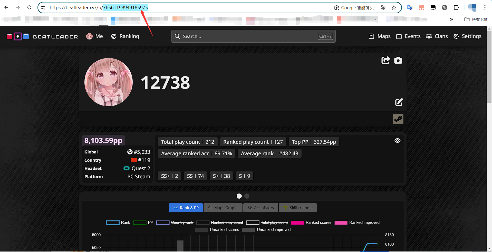
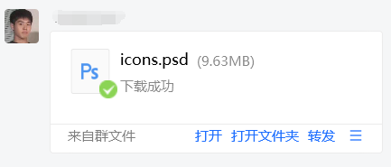

  

 

  
暗色模式有惊喜(指变好看力)

> [!IMPORTANT]
> 此版本修复大量已知bug,建议更新!!!

## 📖 介绍

Nonebot2的节奏光剑BeatLeader&ScoreSaber查分(ﾉ≧∀≦)ﾉ

~~咕噜咕噜咕噜~~

## 💿 安装(以下选择其一安装即可)

使用 nb-cli 安装 (十分甚至九分的推荐)

在 nonebot2 项目的根目录下打开命令行, 输入以下指令即可安装
  
    nb plugin install nonebot-plugin-beatsaberscore

使用 pip 安装

在 nonebot2 项目的根目录下打开命令行, 输入以下指令即可安装
  
    pip install nonebot-plugin-beatsaberscore

如果安装完插件不载入的话,在nonebot文件夹中找到**pyproject.toml**,在**plugins**里面添加**nonebot-plugin-beatsaberscore**就完成了

>如果你的Nonebot2项目下已经启用虚拟环境,可以使用Pipenv安装到项目中,但你需要安装pipenv包
>

使用 pipenv 安装

先安装pipenv
  
    pip install pipenv
  
在 nonebot2 项目的根目录下打开命令行, 输入以下指令即可安装
  
    pipenv install nonebot-plugin-beatsaberscore

## 🔄 更新
> [!NOTE]
> ***请不要用上面的安装方式更新!!!!!!!!!!!!***

使用 nb-cli 更新

在 nonebot2 项目的根目录下打开命令行, 输入以下指令更新
  
    nb plugin install nonebot-plugin-beatsaberscore --upgrade

使用 pip 更新

在 nonebot2 项目的根目录下打开命令行, 输入以下指令即可更新
  
    pip install nonebot-plugin-beatsaberscore --upgrade

## ⚙️ 配置

| 配置项 | 必填 | 默认值 | 说明 |
|:-----:|:----:|:----:|:----:|
| BS_RETRIES | 否 | 8 | 网络错误重试次数 |
| BS_TIMEOUT | 否 | 5 | 网络超时时间 |
| COMMAND_START | 否 | [] | 响应前缀设置 |

PS:最好是有科学上网,如果没有,BS_RETRIES向建议调至6以上

## 🎉 使用

如果设置了响应前缀,使用以下命令的时候不要忘记加上响应前缀

可以发送` BS help `或` BS帮助 `获取帮助(其实也就导航到这里力)

` BS绑定 ` + SteamID 绑定SteamID,绑定ID才可以查分,也可发送` BS bind `,等效` BS绑定 `  
> [!NOTE]
> 先绑定SteamID再查分!!!

***ScoreSaber查分***

` s40 `,` ss40 `,` SS查分 `,` SS score `都可用于触发查分指令

***BeatLeader查分***

` b40 `,` bl40 `,` BL查分 `,` BL score `都可用于触发查分指令

***BeatLeader&ScoreSaber查分***  
` BS查分 `,` bs查分 `,双倍快乐  

***Song_ID查歌***

发送` BS search ` + 歌曲的ID或者` bs查歌 ` + 歌曲的id可以查询歌曲的信息

***Song计算准度***  
> [!NOTE]
> 此功能尚未完善,暂不放出来用了

**SteamID是什么?**

 在登入` beatleader.xyz `后打开个人信息
 
 
 
 这个就是你的` SteamID `辣(即使ID不是纯数字也是可以用的)

 即使是scoresaber排行榜网站也是同理
 
 也可以到Steam个人主页去找SteamID,这里就不多赘述了

## ✨ 未来规划
- [X] 添加对ScoreSaber的查分支持
- [X] 重做优化查分图
- [X] 优化运行速度,使用线上+本地缓存来提高响应速度
- [ ] 定时推送beatsaver的新曲,渲染新曲图片
- [ ] 给自制谱投票功能
- [ ] 歌曲的推荐

## 📝 更新日志
### 1.2.7 ----混沌
- 新增 缓存机制(提升插件性能)
- 更新 SS+,SS,S,A准度评级图标
- 修复 A评级的准度区间
- 修复 ScoreSaber获取歌曲id缺失问题
- 修复 之前极少数用户查分报错问题(已找到原因)
- 修复 准度评级图标的偏移值
- 修复 ScoreSaber&BeatLeader并发查分的报错
- 优化 删除大量无意义循环,大幅精简代码
- 优化 查分图和消息响应的一些细节
- 以及一个大胆的尝试
### 1.1.4 ----**大道至简**
- **大幅改动排版,全面重绘查分图!!!**
- 更新 简陋的歌曲准度计算
- 更新 指令触发细节优化,对一些地方进行细节优化
- 新增 SS+,SS,S,A的准度评级
- 新增 左|右手准度数据(现阶段仅支持beatleader)
- 更改 下调pyproject.toml的httpx,pillow版本依赖(应该可以增强与其他Nonebot插件共存兼容性?)
- 添加 b40,s40指令触发
### 0.9.7.post2
- 修复 [#2](https://github.com/qwq12738qwq/nonebot-plugin-beatsaberscore/issues/2)
### 0.9.7
- ~~修复 [#2](https://github.com/qwq12738qwq/nonebot-plugin-beatsaberscore/issues/2)~~
- 更改了下存储数据的逻辑
### 0.9.6
- 新增 [ScoreSaber的查分支持](https://github.com/qwq12738qwq/nonebot-plugin-beatsaberscore/issues/1)
- 修复 绑定错误ID时返回的一些错误信息进行修正
### 0.9.3
- 增加了歌曲id的搜歌功能
### 0.9.0
- 完成基础的beatleader查分

## 🔍 已知问题
缓存自管理机制,适应小内存的环境(未完工,本次更新不影响下个版本的缓存管理)  

ScoreSaber查分运行性能问题  

绑定信息存在本地,如果换Bot查分的话你需要再绑定一次~  

## 🗨️ 想说的话
之后的某些更新可能需要借助BeatLeader完成对ScoreSaber查分图的优化  
建议**两个排行榜一起用**捏(两个一起用不好嘛( >﹏<。))

本人代码写的比较烂,谨慎pr~~

如果你有更好的想法和建议,随时欢迎提出issues~(●´∀｀●)

可以的话,给个小小的star~,你的star会让我获得happy buff♪（＾∀＾●）ﾉｼ

## 💡 鸣谢

### Homo大佬 ----核心成员,负责本项目的美术ヾ(*´▽‘*)ﾉ  

### [Nonebot框架](https://github.com/nonebot/nonebot2)

## 🎨 效果

enjoy~(●′ω`●)

## 🚧 测试
测试环境  
Unraid-6.11.5 Docker-20.10.21 Ubuntu-24.04 python-3.12.3 nonebot2-2.3.0 httpx-0.23.1 pillow-10.4.0  
