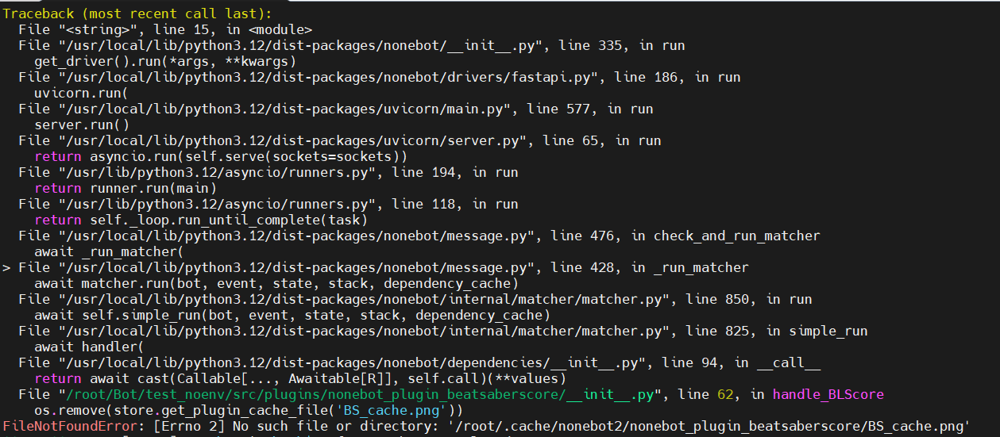
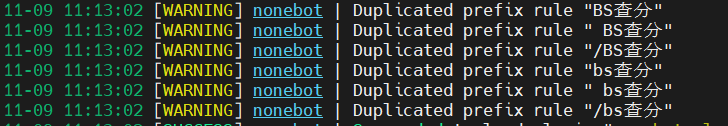
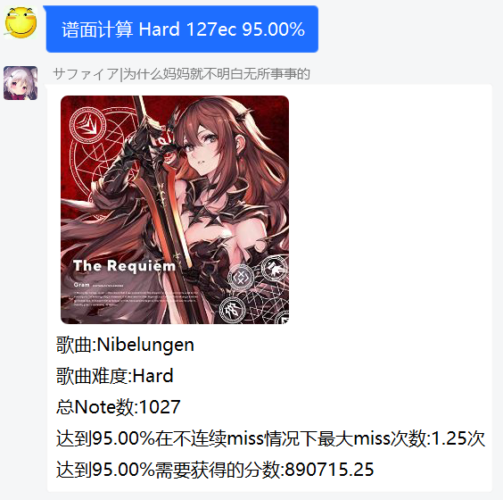
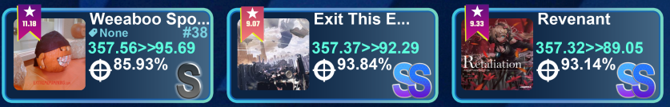

  

 

  
暗色模式有惊喜(指变好看力)

***重要提醒!!!***  
此版本未在运行速度上做一丁点优化(主要是网络下载问题),如介意请等下一个版本更新~[运行速度参考](https://github.com/qwq12738qwq/nonebot-plugin-beatsaberscore?tab=readme-ov-file#-%E6%B5%8B%E8%AF%95)

## 📖 介绍

Nonebot2的节奏光剑BeatLeader&ScoreSaber查分(ﾉ≧∀≦)ﾉ

~~完全不需要介绍,咕噜咕噜咕噜~~

## 💿 安装(以下选择其一安装即可)

使用 nb-cli 安装 (十分甚至九分的推荐)

在 nonebot2 项目的根目录下打开命令行, 输入以下指令即可安装
  
    nb plugin install nonebot-plugin-beatsaberscore

使用 pip 安装

在 nonebot2 项目的根目录下打开命令行, 输入以下指令即可安装
  
    pip install nonebot-plugin-beatsaberscore

如果安装完插件不载入的话,在nonebot文件夹中找到**pyproject.toml**,在**plugins**里面添加**nonebot-plugin-beatsaberscore**就完成了

>如果你的Nonebot2项目下已经启用虚拟环境,可以使用Pipenv安装到项目中,但你需要安装pipenv包
>

使用 pipenv 安装

先安装pipenv
  
    pip install pipenv
  
在 nonebot2 项目的根目录下打开命令行, 输入以下指令即可安装
  
    pipenv install nonebot-plugin-beatsaberscore

## 🔄 更新
***请不要用上面的安装方式更新!!!!!!!!!!!!***

使用 nb-cli 更新

在 nonebot2 项目的根目录下打开命令行, 输入以下指令更新
  
    nb plugin install nonebot-plugin-beatsaberscore --upgrade

使用 pip 更新

在 nonebot2 项目的根目录下打开命令行, 输入以下指令即可更新
  
    pip install nonebot-plugin-beatsaberscore --upgrade

## ⚙️ 配置

| 配置项 | 必填 | 默认值 | 说明 |
|:-----:|:----:|:----:|:----:|
| BS_RETRIES | 否 | 8 | 网络错误重试次数 |
| BS_TIMEOUT | 否 | 5 | 网络超时时间 |
| COMMAND_START | 否 | [] | 响应前缀设置 |

PS:最好是有科学上网,如果没有,BS_RETRIES向建议调至6以上

## 🎉 使用

如果设置了响应前缀,使用以下命令的时候不要忘记加上响应前缀

可以发送` BS help `或` BS帮助 `获取帮助(其实也就导航到这里力)

` BS绑定 ` + SteamID 绑定SteamID,绑定ID才可以查分,也可发送` BS bind `,等效` BS绑定 `  
***注意:***  
先绑定SteamID再查分!!!

***ScoreSaber查分***

` s40 `,` ss40 `,` SS查分 `,` SS score `都可用于触发查分指令

***BeatLeader查分***

` b40 `,` bl40 `,` BL查分 `,` BL score `都可用于触发查分指令

***BeatLeader&ScoreSaber查分***  
` BS查分 `,` bs查分 `,双倍快乐  
PS:如果遇到这种错误,这是我**有意而为之**,忽视即可,不影响正常使用  

***Song_ID查歌***

发送` BS search ` + 歌曲的ID或者` BS查歌 ` + 歌曲的id可以查询歌曲的信息

***Song计算准度***
` 谱面计算 `+ 歌曲id + 难度 + 需要的准度(歌曲id/难度/需要的准度顺序可以打乱)  
举个例子:  
  
**注意**  
此功能尚未完善,miss Note数仅供看着玩(),但我能确保需求分数是准确的

**SteamID是什么?**

 在登入` beatleader.xyz `后打开个人信息
 
 
 
 这个就是你的` SteamID `辣(即使ID不是纯数字也是可以用的)

 即使是scoresaber排行榜网站也是同理
 
 也可以到Steam个人主页去找SteamID,这里就不多赘述了

## ✨ 未来规划
- [X] 添加对ScoreSaber的查分支持
- [X] 重做优化查分图
- [ ] 定时推送beatsaver的新曲,渲染新曲图片
- [ ] 给自制谱投票功能
- [ ] 歌曲的推荐
- [ ] 优化运行速度,使用线上+本地缓存来提高响应速度

## 📝 更新日志
### 1.1.4 ----**大道至简**
- **大幅改动排版,全面重绘查分图!!!**
- 更新 简陋的歌曲准度计算
- 更新 指令触发细节优化,对一些地方进行细节优化
- 新增 SS+,SS,S,A的准度评级
- 新增 左|右手准度数据(现阶段仅支持beatleader)
- 更改 下调pyproject.toml版本依赖(应该可以增强与其他Nonebot插件共存兼容性?)
- 添加 b40,s40指令触发
### 0.9.7.post2
- 修复 [#2](https://github.com/qwq12738qwq/nonebot-plugin-beatsaberscore/issues/2)
### 0.9.7
- ~~修复 [#2](https://github.com/qwq12738qwq/nonebot-plugin-beatsaberscore/issues/2)~~
- 更改了下存储数据的逻辑
### 0.9.6
- 新增 [ScoreSaber的查分支持](https://github.com/qwq12738qwq/nonebot-plugin-beatsaberscore/issues/1)
- 修复 绑定错误ID时返回的一些错误信息进行修正
### 0.9.3
- 增加了歌曲id的搜歌功能
### 0.9.0
- 完成基础的beatleader查分

## 🔍 已知问题
有极少数的SteamID获取不到beatleader中某些信息导致代码报错(换成.get函数不知道怎么样了...)

比其他查分器运行的要慢一些~(现在更久了...( T﹏T ))

(歌曲图片都在海外,如果没有科学上网下载图片会很慢,导致响应时间会变得有些长)

绑定信息存在本地,如果换Bot查分的话你需要再绑定一次

在scoresaber查分下,有个别账号在#36-#40之间id丢失,目前我找不到原因

## 🗨️ 想说的话
之后的某些更新可能需要借助BeatLeader完成对ScoreSaber查分图的优化  
建议**两个排行榜一起用**捏(两个一起用不好嘛( >﹏<。))

还有些地方还没做,但我们也做出相对满意的东西力o(〃’▽’〃)o之后还会慢慢优化的

本人代码写的比较烂,谨慎pr~~

如果你有更好的想法和建议,随时欢迎提出issues~(●´∀｀●)(一些抽象的想法我也会考虑哒)

可以的话,给个小小的star~,你的star会让我获得happy buff♪（＾∀＾●）ﾉｼ

## 💡 鸣谢

### Homo大佬 ----核心成员,负责本项目的绝大部分美术ヾ(*´▽‘*)ﾉ

### [Nonebot框架](https://github.com/nonebot/nonebot2)

## 🎨 效果
At last,效果图(●′ω`●)

enjoy~

## 🚧 测试
测试环境  
Unraid-6.11.5 Docker-20.10.21 Ubuntu-24.04 python-3.12.3 nonebot2-2.3.0 httpx-0.23.1 pillow-10.4.0  
**2分34秒**
